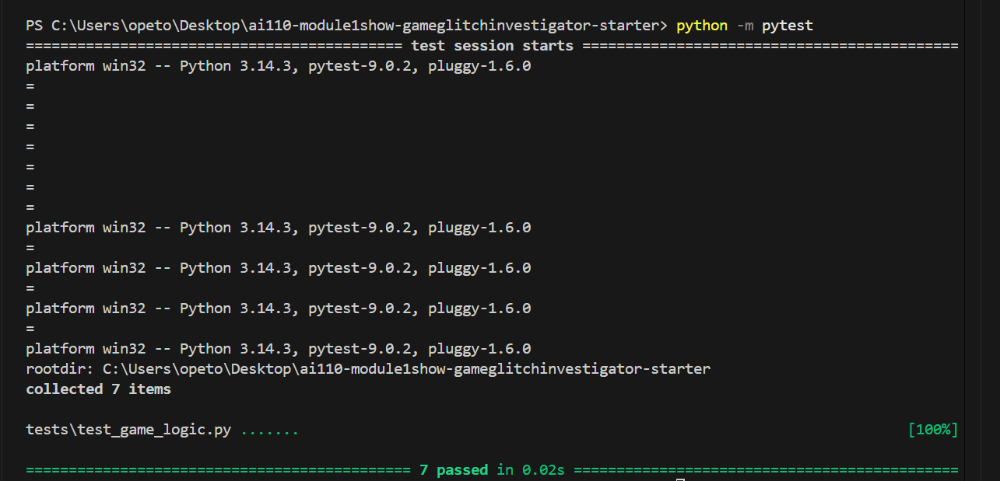

# 🎮 Game Glitch Investigator: The Impossible Guesser

## 🚨 The Situation

You asked an AI to build a simple "Number Guessing Game" using Streamlit.
It wrote the code, ran away, and now the game is unplayable. 

- You can't win.
- The hints lie to you.
- The secret number seems to have commitment issues.

## 🛠️ Setup

1. Install dependencies: `pip install -r requirements.txt`
2. Run the broken app: `python -m streamlit run app.py`

## 🕵️‍♂️ Your Mission

1. **Play the game.** Open the "Developer Debug Info" tab in the app to see the secret number. Try to win.
2. **Find the State Bug.** Why does the secret number change every time you click "Submit"? Ask ChatGPT: *"How do I keep a variable from resetting in Streamlit when I click a button?"*
3. **Fix the Logic.** The hints ("Higher/Lower") are wrong. Fix them.
4. **Refactor & Test.** - Move the logic into `logic_utils.py`.
   - Run `pytest` in your terminal.
   - Keep fixing until all tests pass!

## 📝 Document Your Experience

- [x] Describe the game's purpose.

  This is a number guessing game where the player tries to guess a secret number within a limited number of attempts. Each difficulty level changes the guessing range — Easy (1–20), Normal (1–50), Hard (1–100) and the game gives hints after each guess to guide the player toward the answer.

- [x] Detail which bugs you found.

  1. **Difficulty ranges were swapped** -  Normal had a range of 1–100 and Hard only 1–50, making Hard actually easier than Normal since there were fewer numbers to guess from.
  2. **Main page range was hardcoded** - The info bar always showed "Guess a number between 1 and 100" regardless of the selected difficulty. Only the sidebar updated when difficulty changed, so the player was misled about the actual range in play.
  3. **Hints pointed the wrong direction** - When a guess was too high, the hint said "Go HIGHER!", and when too low it said "Go LOWER!" — the complete opposite of what the player needed, making it impossible to win by following the hints.

- [x] Explain what fixes you applied.

  1. **Swapped the difficulty ranges** - Changed Hard from 1–50 to 1–100 and Normal from 1–100 to 1–50 so each level is progressively harder.
  2. **Fixed the hint messages** in `check_guess`, When `guess > secret`, the hint now correctly says "Go LOWER!", and when `guess < secret` it says "Go HIGHER!"
  3. **Removed the even-attempt type cast** — The caller was converting `secret` to a string on every even-numbered attempt, causing the integer comparison to fail silently and produce wrong hints. Removing that conditional cast so `secret` is always an integer fixed the inconsistency.

## 📸 Demo

- [ ] [Insert a screenshot of your fixed, winning game here]

Py Test Results
This is a screenshot of my pytest results after passing.

## 🚀 Stretch Features

- [ ] [If you choose to complete Challenge 4, insert a screenshot of your Enhanced Game UI here]
